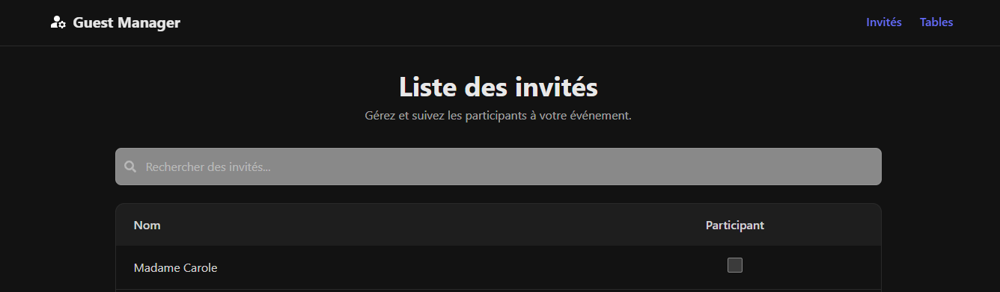
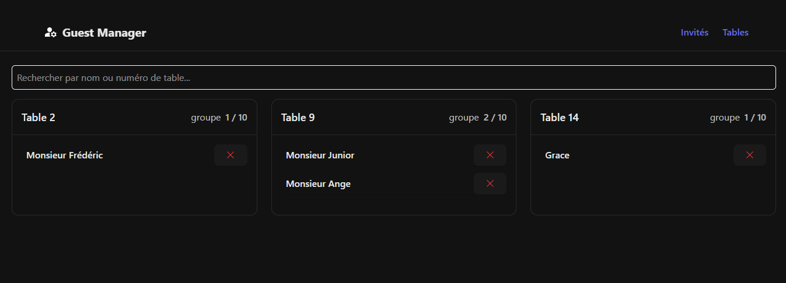

```markdown
# 🎉 Gestion des Invités et Tables

Une application React.js permettant de gérer des invités lors d’un événement et de les assigner à des tables.  
Elle inclut un moteur de recherche avancé pour retrouver rapidement les invités par **nom** ou par **numéro de table**.

---

## 🚀 Fonctionnalités

- ✅ Ajout, suppression et gestion des invités  
- ✅ Attribution des invités aux tables  
- ✅ Recherche par **nom** (avec gestion des accents, ordre des mots flexible)  
- ✅ Recherche par **numéro de table**  
- ✅ Affichage dynamique des cartes de tables (seules les tables correspondantes apparaissent en recherche)  
- ✅ Interface responsive avec **Tailwind CSS**  
- ✅ Stockage géré par Zustand (store local)  

---

## 🛠️ Stack Technique

- [React](https://react.dev/) — Librairie front-end  
- [Zustand](https://github.com/pmndrs/zustand) — Store global pour les invités  
- [Tailwind CSS](https://tailwindcss.com/) — Stylisation  
- [Supabase](https://supabase.com/)  

---

## 📂 Structure du projet

```

src/
├─ components/
│   └─ Tables.tsx        # Composant principal de gestion des tables
│   └─ guestList.tsx        # Liste de tout les invités
├─ store/
│   └─ guestStore.ts     # Store Zustand pour les invités
├─ types/
│   └─ guestType.ts      # Définition du type Guest

````

---

## ⚙️ Installation

1. **Cloner le projet**

   ```bash
   git clone https://github.com/steeven-louk/guest-manager.git
   cd guest-manager
   ````

2. **Installer les dépendances**

   ```bash
   npm install
   # ou
   yarn install
   ```

3. **Lancer le projet en développement**

   ```bash
   npm run dev
   ```

4. Ouvrir dans le navigateur :

   ```
   http://localhost:3000
   ```

---

## 🔎 Exemple de recherche

* `Jean` → retrouve tous les invités avec "Jean" dans leur nom
* `Dup Jean` → retrouve `Jean Dupont` (ordre flexible)
* `4` → affiche uniquement la **table 4** avec ses invités

---

## 📸 Aperçu




---

## 📜 Licence

MIT — libre d’utilisation et de modification.

```
```
